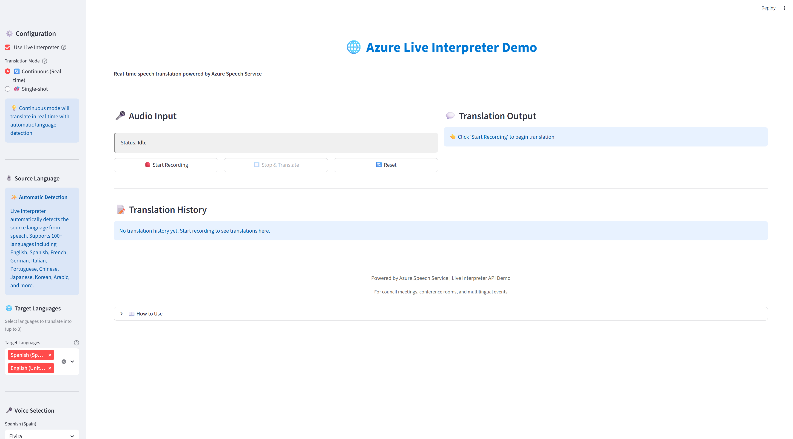
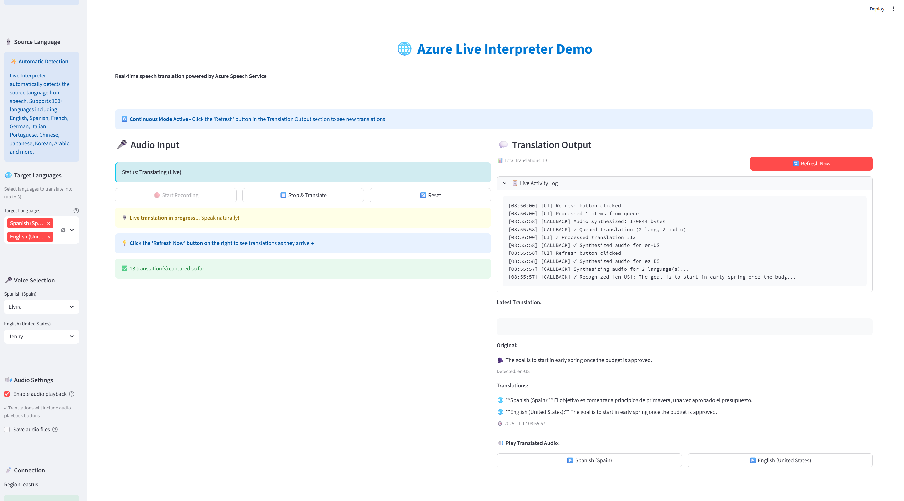
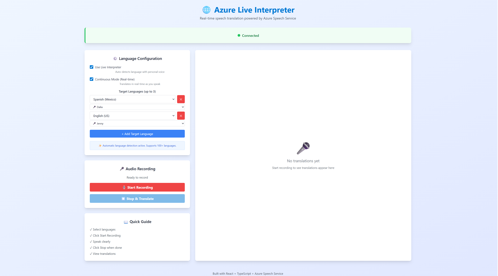
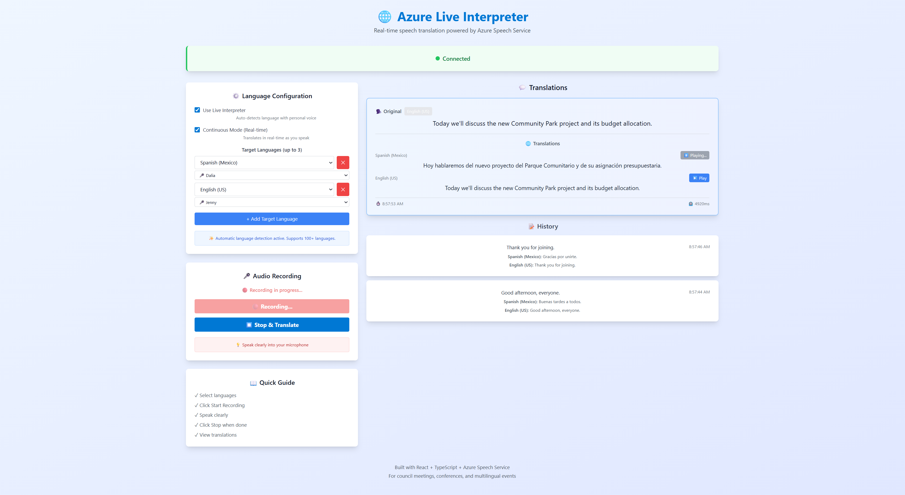

# Azure Live Interpreter API Demo

A comprehensive demonstration of Azure Speech Translation (Live Interpreter) API that captures audio from meetings, translates speech in real-time, and plays back translated audio with captions. This project provides two complete UI implementations: **Python Streamlit** and **React.js with TypeScript**.

### Streamlit App
<p align="center">
  
  
</p>

### React App
<p align="center">
  
  
</p>

## 🎯 Overview

This demo showcases how to implement Azure's Live Interpreter API outside of Microsoft Teams for custom real-time speech translation scenarios. It demonstrates:

- **Audio Capture**: Real-time microphone input from conference room systems or individual devices
- **Cloud Translation**: Azure Speech Translation API with Live Interpreter (personal voice support)
- **Audio Playback**: Translated speech output to speakers, headsets, or broadcast systems
- **Real-time Captions**: Display translated text alongside audio output

## 🔄 Architecture Workflow

### Streamlit App Architecture (Monolithic)
```
┌─────────────────────────────────────────────────────────────────────────────┐
│                          User's Browser / Device                             │
│  ┌───────────────────────────────────────────────────────────────────────┐  │
│  │                     Streamlit Web Application                          │  │
│  │  ╔═══════════════════════════════════════════════════════════════╗   │  │
│  │  ║                        Presentation Layer                      ║   │  │
│  │  ║  ┌─────────────┐  ┌─────────────┐  ┌─────────────┐  ┌──────┐ ║   │  │
│  │  ║  │  Language   │  │    Audio    │  │ Translation │  │Audio │ ║   │  │
│  │  ║  │  Selector   │  │  Recorder   │  │   Display   │  │Player│ ║   │  │
│  │  ║  │  Component  │  │  Component  │  │  Component  │  │ Comp.│ ║   │  │
│  │  ║  └──────┬──────┘  └──────┬──────┘  └──────┬──────┘  └───┬──┘ ║   │  │
│  │  ╚═════════╪════════════════╪═════════════════╪══════════════╪════╝   │  │
│  │            │                │                 │              │        │  │
│  │  ╔═════════╧════════════════╧═════════════════╧══════════════╧════╗   │  │
│  │  ║                    Application Logic Layer                     ║   │  │
│  │  ║  ┌─────────────┐  ┌──────────────────┐  ┌──────────────────┐ ║   │  │
│  │  ║  │   Config    │  │   Translator     │  │  Audio Handler   │ ║   │  │
│  │  ║  │   Manager   │  │   (Live Inter-   │  │  (Capture &      │ ║   │  │
│  │  ║  │   (.env)    │  │    preter API)   │  │   Playback)      │ ║   │  │
│  │  ║  └─────────────┘  └────────┬─────────┘  └────────┬─────────┘ ║   │  │
│  │  ║                            │                      │            ║   │  │
│  │  ║      ┌─────────────────────┴──────────────────────┘            ║   │  │
│  │  ║      │     Azure Speech SDK (Python)                           ║   │  │
│  │  ║      │     - SpeechTranslationConfig                           ║   │  │
│  │  ║      │     - TranslationRecognizer                             ║   │  │
│  │  ║      │     - Callback Event Handlers                           ║   │  │
│  │  ║      └─────────────────────┬──────────────────────────────────║   │  │
│  │  ╚════════════════════════════╪═══════════════════════════════════╝   │  │
│  └─────────────────────────────┬─┴───────────────────────────────────────┘  │
└────────────────────────────────┼─────────────────────────────────────────────┘
                                 │
                                 │ Audio PCM Stream (16kHz)
                                 │ (System Microphone Input)
                                 │
┌────────────────────────────────┼─────────────────────────────────────────────┐
│                System Audio I/O │                                             │
│  ┌──────────────────────────────┴───────────────────────────────┐            │
│  │                     Audio Device Layer                        │            │
│  │  ┌──────────────────┐              ┌──────────────────────┐  │            │
│  │  │   Microphone     │              │  Speaker / Headset   │  │            │
│  │  │   (Input PCM)    │              │  (Output PCM/WAV)    │  │            │
│  │  └──────────────────┘              └──────────────────────┘  │            │
│  └────────────────────────────────────────────────────────────┘             │
└──────────────────────────────────────────────────────────────────────────────┘
                                 │
                                 │ HTTPS / WebSocket Secure
                                 │ (TLS Encrypted)
                                 ▼
┌──────────────────────────────────────────────────────────────────────────────┐
│                       Azure Cloud Services                                    │
│  ┌────────────────────────────────────────────────────────────────────────┐  │
│  │                   Azure Speech Translation Service                      │  │
│  │  ╔══════════════════════════════════════════════════════════════════╗  │  │
│  │  ║                    Live Interpreter Engine                        ║  │  │
│  │  ║  ┌────────────────┐  ┌────────────────┐  ┌──────────────────┐  ║  │  │
│  │  ║  │  Automatic     │  │  Real-time     │  │  Neural Voice    │  ║  │  │
│  │  ║  │  Language      │  │  Speech-to-    │  │  Synthesis       │  ║  │  │
│  │  ║  │  Detection     │  │  Speech        │  │  (Text-to-Speech)│  ║  │  │
│  │  ║  │                │  │  Translation   │  │                  │  ║  │  │
│  │  ║  └────────┬───────┘  └────────┬───────┘  └────────┬─────────┘  ║  │  │
│  │  ║           │                   │                   │             ║  │  │
│  │  ║           └───────────────────┴───────────────────┘             ║  │  │
│  │  ║                    Translation Pipeline:                        ║  │  │
│  │  ║         1. Recognizing events (interim results)                 ║  │  │
│  │  ║         2. Recognized events (final translations)               ║  │  │
│  │  ║         3. Synthesizing events (audio generation)               ║  │  │
│  │  ║         4. Canceled/Stopped events (session control)            ║  │  │
│  │  ╚══════════════════════════════════════════════════════════════════╝  │  │
│  │                                                                          │  │
│  │  Region: eastus, westus2, westeurope, japaneast, southeastasia          │  │
│  │  Latency: ~100-300ms (interim), ~1-2s (final with audio)                │  │
│  └────────────────────────────────────────────────────────────────────────┘  │
└──────────────────────────────────────────────────────────────────────────────┘

Key Characteristics:
  • Monolithic architecture: All components run in single Python process
  • Direct Azure SDK integration: No intermediate backend server
  • Synchronous execution: UI blocks during translation operations
  • Session-based state: Uses Streamlit session_state for data persistence
  • Simplified deployment: Single app.py file to run
```

### React App Architecture (Client-Server)
```
┌──────────────────────────────────────────────────────────────────┐
│                    React Frontend (Browser)                       │
│  ┌────────────────────────────────────────────────────────────┐  │
│  │                     UI Components                           │  │
│  │  ┌──────────┐  ┌──────────┐  ┌──────────┐  ┌──────────┐  │  │
│  │  │ Language │  │  Audio   │  │Translation│ │Connection│  │  │
│  │  │ Selector │  │ Recorder │  │  Display  │ │  Status  │  │  │
│  │  └────┬─────┘  └────┬─────┘  └────┬─────┘  └────┬─────┘  │  │
│  └───────┼─────────────┼─────────────┼─────────────┼─────────┘  │
│          │             │             │             │             │
│  ┌───────┴─────────────┴─────────────┴─────────────┴─────────┐  │
│  │                     Custom Hooks                           │  │
│  │  ┌──────────────┐  ┌──────────────┐  ┌──────────────┐   │  │
│  │  │ useWebSocket │  │useAudioRecorder│ │useTranslation│   │  │
│  │  └──────┬───────┘  └──────┬───────┘  └──────┬───────┘   │  │
│  └─────────┼──────────────────┼──────────────────┼───────────┘  │
└────────────┼──────────────────┼──────────────────┼──────────────┘
             │                  │                  │
             │ WebSocket        │ getUserMedia()   │ Web Audio API
             │ (ws://...)       │                  │
             │                  │                  │
┌────────────┴──────────────────┴──────────────────┴──────────────┐
│              FastAPI Backend Server (Python)                     │
│  ┌────────────────────────────────────────────────────────────┐ │
│  │                  WebSocket Handler                          │ │
│  │  ┌──────────────┐  ┌──────────────┐  ┌──────────────┐    │ │
│  │  │ Connection   │  │   Message    │  │   Session    │    │ │
│  │  │   Manager    │  │   Router     │  │   Manager    │    │ │
│  │  └──────┬───────┘  └──────┬───────┘  └──────┬───────┘    │ │
│  └─────────┼──────────────────┼──────────────────┼───────────┘ │
│  ┌─────────┴──────────────────┴──────────────────┴───────────┐ │
│  │                    Core Services                           │ │
│  │  ┌────────────────┐  ┌─────────────────┐  ┌────────────┐ │ │
│  │  │    Config      │  │   Translator    │  │   Audio    │ │ │
│  │  │   Manager      │  │ (LiveInterpreter)│  │  Handler   │ │ │
│  │  └────────────────┘  └─────────────────┘  └────────────┘ │ │
│  └──────────────────────────┬──────────────────────────────────┘ │
└────────────────────────────┼───────────────────────────────────┘
                             │
                    ┌────────┴────────┐
                    │  Azure Speech   │
                    │  Translation    │
                    │    Service      │
                    │  (Live Inter-   │
                    │    preter)      │
                    └─────────────────┘
```

### Data Flow: Translation Workflow

#### Continuous Mode (Real-time Translation)
```
1. User Action
   ├─ Click "Start Recording"
   │
2. Audio Capture
   ├─ Microphone → Audio Stream → Azure Speech SDK
   │
3. Azure Processing (Continuous)
   ├─ Speech Recognition (Interim Results)
   │  └─> "recognizing" event → Interim text
   │
   ├─ Language Detection (Auto)
   │  └─> Detect source language dynamically
   │
   ├─ Translation Engine
   │  └─> Translate to target language(s)
   │
   ├─ Speech Recognition (Final Results)
   │  └─> "recognized" event → Final text + translations
   │
   └─ Audio Synthesis (Optional)
      └─> Neural TTS → Base64 audio bytes
   
4. Client Display
   ├─ Interim: Yellow box with "Recognizing..."
   ├─ Final: Blue box with translation
   └─ Audio: Play button for synthesized audio
   
5. User Action
   └─ Click "Stop Recording" → End session
```

#### Single-shot Mode (Record then Translate)
```
1. User Action
   ├─ Click "Start Recording"
   │
2. Audio Capture
   ├─ Buffer audio locally
   ├─ Save to temporary file
   │
3. User Action
   ├─ Click "Stop Recording"
   │
4. Azure Processing (One-time)
   ├─ Upload audio file
   ├─ Speech Recognition
   ├─ Language Detection
   ├─ Translation
   └─ Audio Synthesis
   
5. Display Results
   └─ Show all results at once
```

### Message Flow: React WebSocket Communication

```
┌──────────┐                    ┌──────────┐                    ┌──────────┐
│  Client  │                    │ Backend  │                    │  Azure   │
│ (Browser)│                    │ (FastAPI)│                    │ Speech   │
└────┬─────┘                    └────┬─────┘                    └────┬─────┘
     │                               │                               │
     │ 1. WebSocket Connect          │                               │
     ├──────────────────────────────>│                               │
     │                               │                               │
     │ 2. Connection Accepted        │                               │
     │<──────────────────────────────┤                               │
     │                               │                               │
     │ 3. Send Config                │                               │
     │ { type: "config",             │                               │
     │   source_language: "en-US",   │                               │
     │   target_languages: ["es-ES"],│                               │
     │   use_continuous_mode: true } │                               │
     ├──────────────────────────────>│                               │
     │                               │ 4. Initialize Translator      │
     │                               │   - Create Speech Config      │
     │                               │   - Add Target Languages      │
     │                               │   - Set Voice Preferences     │
     │                               ├──────────────────────────────>│
     │                               │                               │
     │                               │ 5. Translator Ready           │
     │                               │<──────────────────────────────┤
     │                               │                               │
     │ 6. Config Confirmed           │                               │
     │ { type: "config_confirmed",   │                               │
     │   use_live_interpreter: true }│                               │
     │<──────────────────────────────┤                               │
     │                               │                               │
     │ 7. Start Recording            │                               │
     │ { type: "start_recording" }   │                               │
     ├──────────────────────────────>│                               │
     │                               │ 8. Create Recognizer          │
     │                               │   - Setup Microphone Input    │
     │                               │   - Register Callbacks        │
     │                               ├──────────────────────────────>│
     │                               │                               │
     │                               │ 9. Start Continuous           │
     │                               │    Recognition                │
     │                               ├──────────────────────────────>│
     │                               │                               │
     ┌─ Continuous Loop ─────────────────────────────────────────────┐
     │                               │                               │
     │                               │ 10. Audio Stream (PCM)        │
     │                               │    (Microphone input)         │
     │                               ├──────────────────────────────>│
     │                               │                               │
     │                               │ 11. Recognizing Event         │
     │                               │     (Interim Results)         │
     │                               │<──────────────────────────────┤
     │                               │                               │
     │ 12. Interim Translation       │                               │
     │ { type: "recognizing",        │                               │
     │   original_text: "Hello...",  │                               │
     │   translations: {             │                               │
     │     "es-ES": "Hola..."        │                               │
     │   }                           │                               │
     │ }                             │                               │
     │<──────────────────────────────┤                               │
     │                               │                               │
     │ [User continues speaking...]  │                               │
     │                               │                               │
     │                               │ 13. More Audio Chunks         │
     │                               ├──────────────────────────────>│
     │                               │                               │
     │                               │ 14. Recognized Event          │
     │                               │     (Final Results)           │
     │                               │<──────────────────────────────┤
     │                               │                               │
     │                               │ 15. Synthesize Audio          │
     │                               │     for each target language  │
     │                               ├──────────────────────────────>│
     │                               │                               │
     │                               │ 16. Audio Data (WAV/PCM16)    │
     │                               │<──────────────────────────────┤
     │                               │                               │
     │ 17. Final Translation         │                               │
     │ { type: "recognized",         │                               │
     │   original_text: "Hello...",  │                               │
     │   translations: {             │                               │
     │     "es-ES": "Hola..."        │                               │
     │   },                          │                               │
     │   detected_language: "en-US", │                               │
     │   synthesized_audio: {        │                               │
     │     "es-ES": "base64data..."  │                               │
     │   },                          │                               │
     │   timestamp: "2025-11-14..." }│                               │
     │<──────────────────────────────┤                               │
     │                               │                               │
     │ [Display translation + audio] │                               │
     │ [Repeat for each utterance]   │                               │
     │                               │                               │
     └───────────────────────────────────────────────────────────────┘
     │                               │                               │
     │ 18. Stop Recording            │                               │
     │ { type: "stop_recording" }    │                               │
     ├──────────────────────────────>│                               │
     │                               │ 19. Stop Recognition          │
     │                               ├──────────────────────────────>│
     │                               │                               │
     │                               │ 20. Session Stopped           │
     │                               │<──────────────────────────────┤
     │                               │                               │
     │ 21. Stopped Confirmation      │                               │
     │ { type: "stopped" }           │                               │
     │<──────────────────────────────┤                               │
     │                               │                               │
     │ 22. Close WebSocket           │                               │
     │ (if user leaves)              │                               │
     ├──────────────────────────────>│                               │
     │                               │ 23. Cleanup Resources         │
     │                               │   - Remove from connections   │
     │                               │   - Release translator        │
     │                               ├──────────────────────────────>│
     │                               │                               │
     │ 24. Connection Closed         │                               │
     │<──────────────────────────────┤                               │
     │                               │                               │

Legend:
━━━━━ WebSocket Messages (JSON)
═════ Azure SDK Calls
┌───┐ Continuous Loop Section
```

**Key Message Types:**

| Message Type | Direction | Purpose | Data Fields |
|--------------|-----------|---------|-------------|
| `config` | Client → Backend | Initialize translator with languages | `source_language`, `target_languages`, `use_live_interpreter`, `use_continuous_mode`, `voice_preferences` |
| `config_confirmed` | Backend → Client | Confirm translator ready | `use_live_interpreter`, `source_language`, `target_languages` |
| `start_recording` | Client → Backend | Begin continuous translation | None |
| `recognizing` | Backend → Client | Interim recognition results | `original_text`, `translations`, `detected_language` |
| `recognized` | Backend → Client | Final translation with audio | `original_text`, `translations`, `detected_language`, `timestamp`, `duration_ms`, `synthesized_audio` |
| `audio` | Backend → Client | Raw synthesized audio stream | `audio` (base64), `format`, `sample_rate` |
| `stop_recording` | Client → Backend | End continuous translation | None |
| `stopped` | Backend → Client | Confirm translation stopped | `message` |
| `error` | Backend → Client | Report errors | `message` |

**Audio Data Flow:**

1. **Microphone → Azure**: PCM16 audio stream at 16kHz sample rate
2. **Azure → Backend**: Recognition events with text and translations
3. **Backend → Azure**: Text to Neural TTS engine for synthesis
4. **Azure → Backend**: WAV/PCM16 audio bytes
5. **Backend → Client**: Base64-encoded audio in JSON message
6. **Client → Speaker**: Decode Base64, create Audio Buffer, play via Web Audio API

**Event Loop Timing:**

- **Interim Results**: ~100-300ms after speech starts (shows "Recognizing...")
- **Final Results**: ~500ms after speech ends (shows complete translation)
- **Audio Synthesis**: ~500-1000ms (neural TTS processing)
- **Total Latency**: ~1-2 seconds from speech end to translated audio playback

### Component Responsibilities

#### Shared Core Services (Both Apps)
- **`translator.py`**: Azure Speech SDK integration, translation logic
- **`audio_handler.py`**: Audio capture, playback, format conversion
- **`config.py`**: Environment variables, settings management

#### Streamlit-Specific
- **`app.py`**: Main application, UI components, session state
- **Components**: Modular UI widgets, inline in main app
- **Callbacks**: Python functions for translation events

#### React-Specific
- **Backend (`main.py`)**: FastAPI server, WebSocket handler, translation orchestration
- **Frontend (`App.tsx`)**: React components, state management, WebSocket client
- **Hooks**: `useWebSocket`, `useAudioRecorder` for reusable logic
- **Types**: TypeScript interfaces for type safety

## 🏛️ Use Case: Council Meeting / Conference Room

**Scenario**: A bilingual council meeting or conference with English and Spanish speakers

### Requirements
- Real-time translation between English and Spanish
- Audio feed from conference room microphone system
- Translated audio output to:
  - Conference room speakers for in-person attendees
  - Individual headsets for personal listening
  - Mobile device speakers for remote participants
  - On-premises broadcasting systems

### Architecture Options

#### Option 1: Direct Microphone to Cloud (Simple Setup)
```
Microphone → Computer/Device → Azure Speech Translation → Local Speakers/Headsets
```
**Best for**: Small meetings, individual users, quick setup

#### Option 2: Audio Mixer Integration (Professional Setup)
```
Conference Mics → Audio Mixer → Computer with Demo App → Azure Cloud → Output Mixer → 
├── Room Speakers (Channel A: Original)
├── Room Speakers (Channel B: Translated)
└── Individual Headsets
```
**Best for**: Large conference rooms, professional AV systems

#### Option 3: Streaming Distribution (Hybrid/Remote)
```
Room Audio → Capture Device → Azure Translation → FastAPI WebSocket Server →
├── Local Speakers
├── Web Browser Clients (Remote attendees)
└── Mobile App Clients
```
**Best for**: Hybrid meetings, remote participants, scalability

## 🏗️ Project Structure

```
live-interpreter-api-demo/
├── README.md                          # This file
├── pyproject.toml                     # Python dependencies
├── .env.example                       # Environment variables template
├── .gitignore                        # Git ignore rules
│
├── src/
│   ├── __init__.py
│   │
│   ├── core/                         # Shared core services
│   │   ├── __init__.py
│   │   ├── translator.py             # Azure Speech Translation service
│   │   ├── audio_handler.py          # Audio capture and playback
│   │   └── config.py                 # Configuration management
│   │
│   ├── streamlit_app/                # Streamlit UI Implementation
│   │   ├── __init__.py
│   │   ├── app.py                    # Main Streamlit application
│   │   ├── components/
│   │   │   ├── __init__.py
│   │   │   ├── audio_recorder.py     # Audio recording component
│   │   │   ├── language_selector.py  # Language selection UI
│   │   │   ├── translation_display.py # Translation results display
│   │   │   └── audio_player.py       # Audio playback component
│   │   └── README.md                 # Streamlit-specific documentation
│   │
│   └── react_app/                    # React + TypeScript Implementation
│       ├── backend/                  # FastAPI WebSocket server
│       │   ├── __init__.py
│       │   ├── main.py               # FastAPI application
│       │   ├── websocket_handler.py  # WebSocket connection handler
│       │   └── requirements.txt      # Backend-specific requirements
│       │
│       ├── frontend/                 # React TypeScript app
│       │   ├── package.json
│       │   ├── tsconfig.json
│       │   ├── vite.config.ts
│       │   ├── index.html
│       │   ├── src/
│       │   │   ├── main.tsx
│       │   │   ├── App.tsx
│       │   │   ├── components/
│       │   │   │   ├── AudioRecorder.tsx
│       │   │   │   ├── LanguageSelector.tsx
│       │   │   │   ├── TranslationDisplay.tsx
│       │   │   │   ├── AudioPlayer.tsx
│       │   │   │   └── ConnectionStatus.tsx
│       │   │   ├── hooks/
│       │   │   │   ├── useWebSocket.ts
│       │   │   │   ├── useAudioRecorder.ts
│       │   │   │   └── useTranslation.ts
│       │   │   ├── services/
│       │   │   │   └── api.ts
│       │   │   └── types/
│       │   │       └── translation.ts
│       │   └── public/
│       │
│       └── README.md                 # React app documentation
│
├── docs/                             # Additional documentation
│   ├── ARCHITECTURE.md               # System architecture details
│   ├── DEPLOYMENT.md                 # Deployment guide
│   └── API_REFERENCE.md              # API documentation
│
└── examples/                         # Example configurations
    ├── council_meeting_setup.md      # Council meeting specific setup
    ├── conference_room_av_setup.md   # Professional AV integration
    └── sample_configs/
        ├── english_spanish.json      # EN-ES configuration
        └── multi_language.json       # Multi-language configuration
```

## 🚀 Getting Started

### Prerequisites

1. **Azure Speech Service**
   - Azure subscription ([Create free account](https://azure.microsoft.com/free/))
   - Speech Service resource ([Create resource](https://portal.azure.com/#create/Microsoft.CognitiveServicesSpeechServices))
   - **Important**: For Live Interpreter, use regions: `eastus`, `westus2`, `westeurope`, `japaneast`, or `southeastasia`

2. **System Requirements**
   - Python 3.12 or higher
   - Node.js 18+ (for React app)
   - Microphone access
   - Audio output device

### Installation

1. **Clone the repository**
   ```bash
   git clone <repository-url>
   cd live-interpreter-api-demo
   ```

   ```bash
   az login
   ```

2. **Set up Python environment**
   ```bash
   python -m venv venv
   source venv/bin/activate  # On Windows: venv\Scripts\activate
   pip install -e .
   ```

3. **Configure environment variables**
   ```bash
   cp .env.example .env
   # Edit .env with your Azure credentials
   ```

4. **Required Environment Variables**
   ```env
   # Azure Speech Service
   SPEECH_KEY=your_speech_service_key
   SPEECH_REGION=eastus  # Must support Live Interpreter
   
   # Optional: For Live Interpreter
   SPEECH_ENDPOINT=https://eastus.api.cognitive.microsoft.com
   
   # Translation Settings
   SOURCE_LANGUAGE=en-US
   TARGET_LANGUAGE=es-ES
   
   # Voice Settings - Choose one:
   # Option A: Prebuilt Neural Voice (no approval needed)
   VOICE_NAME=en-US-JennyNeural
   
   # Option B: Personal Voice (requires Azure approval)
   # VOICE_NAME=personal-voice
   ```

5. **Choosing Voice Mode**

   **For Live Interpreter with Prebuilt Voice (Recommended)**:
   ```env
   ENABLE_LIVE_INTERPRETER=true
   VOICE_NAME=en-US-JennyNeural  # Or any supported neural voice
   ```
   - Works immediately without special approval
   - Supports 50+ languages with high-quality voices
   - Examples: `es-ES-ElviraNeural`, `fr-FR-DeniseNeural`, `de-DE-KatjaNeural`

   **For Live Interpreter with Personal Voice** (requires approval):
   ```env
   ENABLE_LIVE_INTERPRETER=true
   VOICE_NAME=personal-voice
   ```
   - Preserves original speaker's voice characteristics
   - Apply for access: https://aka.ms/customneural

### Running the Streamlit App

```bash
cd src/streamlit_app
streamlit run app.py
```

Open browser to `http://localhost:8501`

**Demo Mode (Simulated Meeting - No Microphone Required)**:
```bash
cd src/streamlit_app
streamlit run app_demo.py
```

The demo app showcases a simulated council meeting with pre-scripted English/Spanish dialogue, perfect for demonstrations, training, or testing the UI without Azure API costs.

### Running the React App

**Option 1: Quick Start (Recommended)**
```bash
cd src/react_app
./start.sh
```
This single command will:
- Check all prerequisites (Python, Node.js, npm, .env file)
- Install dependencies if needed
- Start both backend and frontend servers
- Display health status and URLs
- Tail logs from both servers

Open browser to `http://localhost:5173`

**Option 2: Manual Start**

**Terminal 1 - Backend:**
```bash
cd src/react_app/backend
uvicorn main:app --reload --port 8000
```

**Terminal 2 - Frontend:**
```bash
cd src/react_app/frontend
npm install
npm run dev
```

Open browser to `http://localhost:5173`

> **Note**: On Windows, use `start.bat` instead of `start.sh`

**Demo Mode (Simulated Meeting - No Backend Required)**:
```bash
cd src/react_app
./start-demo.sh  # Windows: start-demo.bat
```

The React demo app runs entirely in the browser with simulated translations, requiring no Azure API or microphone. Perfect for:
- Sales demonstrations at trade shows
- Training sessions without live setup
- UI/UX testing without Azure costs
- Creating documentation and videos

See [DEMO_README.md](src/react_app/DEMO_README.md) for full demo documentation.

## 🎛️ Features

### Streamlit App Features
- ✅ One-click audio recording with visual feedback
- ✅ Real-time translation status display
- ✅ Language pair selection (50+ languages)
- ✅ Live captions with timestamps
- ✅ Audio playback of translated speech
- ✅ Translation history with export
- ✅ Simple configuration interface
- ✅ **Demo mode** with simulated council meeting

### React App Features
- ✅ Modern responsive UI with Tailwind CSS
- ✅ WebSocket-based real-time streaming
- ✅ Dynamic audio recording controls
- ✅ Live connection status indicator
- ✅ Interactive language selection
- ✅ Real-time caption streaming
- ✅ Audio visualization
- ✅ Mobile-responsive design
- ✅ **Demo mode** with no backend required (browser-only)
- ✅ Live connection status indicator
- ✅ Interactive language selection
- ✅ Real-time caption streaming
- ✅ Audio visualization
- ✅ Mobile-responsive design

## � Code Examples

### Using Live Interpreter with Prebuilt Voice (Python)

```python
from src.core.config import get_settings
from src.core.translator import LiveInterpreterTranslator

# Load settings from .env file
settings = get_settings()

# Create translator with prebuilt neural voice (default behavior)
translator = LiveInterpreterTranslator(settings)

# Or explicitly set prebuilt voice mode
translator = LiveInterpreterTranslator(settings, use_personal_voice=False)

# Create recognizer and start translation
recognizer = translator.create_recognizer_from_microphone(
    auto_detect_languages=["en-US", "es-ES", "fr-FR"]
)

# Start continuous translation with callbacks
translator.start_continuous_translation(
    recognizer=recognizer,
    recognized_callback=lambda result: print(f"Translated: {result.translations}")
)
```

### Using Live Interpreter with Personal Voice (Python)

```python
from src.core.config import get_settings
from src.core.translator import LiveInterpreterTranslator

# Ensure VOICE_NAME=personal-voice in .env file
settings = get_settings()

# Create translator with personal voice mode
translator = LiveInterpreterTranslator(settings, use_personal_voice=True)

# Rest of the code is the same...
recognizer = translator.create_recognizer_from_microphone()
translator.start_continuous_translation(recognizer, ...)
```

### Configuration Toggle

In your `.env` file:

```bash
# For Prebuilt Neural Voice (Recommended)
ENABLE_LIVE_INTERPRETER=true
VOICE_NAME=en-US-JennyNeural

# For Personal Voice (Requires Approval)
ENABLE_LIVE_INTERPRETER=true
VOICE_NAME=personal-voice
```

## �🔧 Configuration Options

### Translation Modes

#### 1. Standard Speech Translation
- Source language: Specified (e.g., en-US)
- Target language: One or more languages
- Voice output: Neural voices
- **Best for**: Single-language meetings, predictable scenarios

#### 2. Live Interpreter with Prebuilt Neural Voice (Recommended)
- ✅ **No approval required** - works immediately
- Automatic language detection
- Low latency speech-to-speech translation
- High-quality prebuilt neural voices (50+ languages)
- Continuous language ID mode for seamless switching
- **Best for**: Most production scenarios, multilingual meetings

#### 3. Live Interpreter with Personal Voice (Advanced)
- Automatic language detection
- Low latency speech-to-speech translation
- **Personal voice preservation** - maintains speaker's voice characteristics
- ⚠️ Requires approval: [Apply here](https://aka.ms/customneural)
- **Best for**: VIP meetings, high-profile events, when voice preservation is critical

### Voice Options Explained

#### Prebuilt Neural Voices (Default - No Approval Needed)
- **Availability**: Immediate use with any Azure Speech subscription
- **Quality**: High-quality, natural-sounding AI voices
- **Languages**: 50+ languages with multiple voice options per language
- **Latency**: Low latency suitable for real-time translation
- **Use Cases**: 
  - Council meetings with multiple languages
  - Conference room translations
  - Public events and presentations
  - Educational settings

**Popular Neural Voices**:
| Language | Voice Name | Gender | Description |
|----------|-----------|---------|-------------|
| English (US) | en-US-JennyNeural | Female | Professional, clear |
| English (US) | en-US-GuyNeural | Male | Warm, friendly |
| Spanish (Spain) | es-ES-ElviraNeural | Female | Clear, expressive |
| Spanish (Mexico) | es-MX-DaliaNeural | Female | Natural, warm |
| French (France) | fr-FR-DeniseNeural | Female | Professional |
| German | de-DE-KatjaNeural | Female | Clear, friendly |

[View all neural voices](https://learn.microsoft.com/azure/ai-services/speech-service/language-support?tabs=tts)

#### Personal Voice (Advanced - Requires Approval)
- **Availability**: Requires Azure approval (apply at https://aka.ms/customneural)
- **Quality**: Preserves original speaker's voice tone, pitch, and speaking style
- **Processing**: Uses voice characteristics from source audio
- **Use Cases**:
  - High-profile speakers (politicians, executives)
  - Brand voice consistency
  - Celebrity or VIP events
  - Medical/therapy sessions where voice familiarity matters

**Approval Process**:
1. Apply through Azure portal
2. Provide use case justification
3. Wait for approval (typically 1-2 weeks)
4. Set `VOICE_NAME=personal-voice` in configuration

**Comparison**:
| Feature | Prebuilt Neural | Personal Voice |
|---------|----------------|----------------|
| Setup Time | Instant | 1-2 weeks approval |
| Voice Quality | Excellent | Preserves original |
| Cost | Standard rate | Standard rate |
| Best For | General use | VIP scenarios |

### Audio Input Options

#### Software-based
- **Desktop Microphone**: Built-in or USB microphone
- **Audio Interface**: Professional audio interface (Focusrite, Behringer, etc.)
- **Virtual Audio Cable**: Route audio from mixing software

#### Hardware-based
- **USB Conference Microphone**: Jabra, Poly, Logitech conference systems
- **Wireless Microphone System**: Sennheiser, Shure with USB output
- **Audio Mixer**: Connect room mics → mixer → USB audio interface

### Audio Output Options

#### Individual Listening
- **Headphones/Headsets**: Direct connection to computer
- **Bluetooth Speakers**: For mobile or portable setups
- **USB Speakers**: Desktop speakers

#### Room Broadcasting
- **PA System**: Computer → mixer → PA amplifier → room speakers
- **Multi-channel Output**: Audio interface with multiple outputs:
  - Channel 1: Original language
  - Channel 2: Translated language
- **Dante/AoIP**: Network audio distribution (advanced)

### Network Requirements

| Feature | Bandwidth | Latency |
|---------|-----------|---------|
| Audio Streaming | ~128 kbps | < 100ms preferred |
| Speech Translation | ~256 kbps | < 200ms |
| WebSocket (React) | ~384 kbps | < 150ms |

## 📊 Supported Languages

### High-Priority for Council Meetings
- **English** (en-US) ↔ **Spanish** (es-ES, es-MX)
- **English** (en-US) ↔ **French** (fr-FR, fr-CA)
- **English** (en-US) ↔ **Mandarin** (zh-CN)
- **English** (en-US) ↔ **Portuguese** (pt-BR)

See [Azure Speech Translation Language Support](https://learn.microsoft.com/azure/ai-services/speech-service/language-support?tabs=speech-translation) for complete list.

## 🔐 Security & Privacy

- **Audio Data**: Processed by Azure, not stored by default
- **Personal Voice**: Voice samples are NOT stored (Live Interpreter)
- **Network**: Use HTTPS/WSS in production
- **API Keys**: Store in environment variables, never commit
- **Compliance**: Azure Speech Service is GDPR, HIPAA, SOC compliant

## 🚦 Deployment Considerations

### Development Environment
- Local testing with microphone
- Single language pair
- No persistent storage

### Production Environment
- Azure VM or App Service for backend
- Static web hosting for React frontend
- Redis for session management
- Application Insights for monitoring
- Azure Key Vault for secrets
- Load balancer for high availability

### Council Meeting Production Setup

#### Hardware Shopping List
1. **Conference Microphone**: Jabra Speak 750 (~$200)
2. **Audio Interface**: Focusrite Scarlett 2i2 (~$180)
3. **Computer**: Intel i5/Ryzen 5, 8GB RAM minimum
4. **Speakers**: Powered monitors or PA system
5. **Headphone Amplifier**: For multiple individual listeners (~$100)
6. **Optional**: Wireless mics for speakers (~$300-500)

#### Software Stack
- Windows 10/11 or Ubuntu 22.04 LTS
- Python 3.12+ environment
- Azure Speech Service subscription (~$1/hour translation)
- OBS Studio (optional, for recording/streaming)

#### Network Setup
- 10 Mbps upload minimum
- Static IP or dynamic DNS
- Firewall rules for WebSocket (port 8000)
- VPN for remote admin access (optional)

## 💰 Cost Estimation

### Azure Speech Service Pricing
- **Speech to Text**: $1.00/hour
- **Speech Translation**: $2.50/hour (up to 2 target languages)
- **Additional Languages**: +$0.50/language/hour
- **Text to Speech**: $16.00/1M characters (Neural voices)

### Example: 2-hour Council Meeting (EN ↔ ES)
- Translation: $5.00
- Synthesis: ~$0.50
- **Total**: ~$5.50 per meeting

[Azure Speech Pricing Details](https://azure.microsoft.com/pricing/details/cognitive-services/speech-services/)

## 🐛 Troubleshooting

### Common Issues

**"Audio not capturing"**
- Check microphone permissions in OS
- Verify microphone selected in app
- Test with system audio settings

**"Translation not working"**
- Verify Azure credentials in .env
- Check region supports Live Interpreter
- Ensure internet connection is stable

**"High latency"**
- Use wired connection instead of WiFi
- Close bandwidth-intensive applications
- Consider Azure region closer to location

**"No audio output"**
- Check speaker/headphone connection
- Verify audio output device in app
- Test system volume levels

## 📚 Additional Resources

- [Azure Speech Translation Documentation](https://learn.microsoft.com/azure/ai-services/speech-service/speech-translation)
- [Live Interpreter Overview](https://learn.microsoft.com/azure/ai-services/speech-service/how-to-translate-speech#using-live-interpreter-preview)
- [Speech SDK Python Reference](https://learn.microsoft.com/python/api/azure-cognitiveservices-speech/)
- [React WebSocket Guide](https://developer.mozilla.org/en-US/docs/Web/API/WebSockets_API)

## 🤝 Contributing

Contributions welcome! Please read CONTRIBUTING.md for guidelines.

## 📄 License

This project is licensed under the MIT License - see LICENSE file for details.

## 🙏 Acknowledgments

- Azure Speech Service team for Live Interpreter API
- Streamlit for rapid UI development
- React and Vite communities
- Conference room AV integration insights from community feedback

## 📞 Support

For issues and questions:
- Open an issue on GitHub
- Check documentation in `/docs` folder
- Review example configurations in `/examples`

---

**Built with ❤️ for multilingual communication accessibility**
