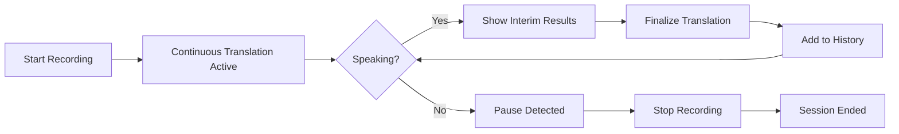

# Continuous Translation Mode Guide

## Overview

The Streamlit app now defaults to **Continuous Translation Mode** when using the Live Interpreter API. This provides real-time translation as you speak, with automatic language detection and instant results.

## Key Features

### 🔄 Continuous Mode (Default)
- **Real-time translation**: Translations appear within 1-2 seconds as you speak
- **Automatic language detection**: Switch between languages naturally
- **Interim results**: See partial translations while speaking
- **Multi-language support**: Detects 9+ common languages automatically
- **No manual switching**: Just speak - the system handles language changes

### 🎯 Single-shot Mode (Optional)
- Traditional record-then-translate workflow
- Process complete recordings after stopping
- Useful for shorter, single-language recordings

## How It Works

### Starting a Session

1. **Enable Live Interpreter** (default in settings)
2. **Select Translation Mode** in sidebar:
   - 🔄 Continuous (Real-time) - Default
   - 🎯 Single-shot
3. **Choose target languages** for translation
4. **Click "Start Recording"**

### During Continuous Translation

```
┌─────────────────────────────────────────────┐
│  Status: Translating (Live)                 │
│                                              │
│  🎙️ Live translation in progress...         │
│  💡 Switch languages naturally               │
└─────────────────────────────────────────────┘

┌─────────────────────────────────────────────┐
│  💬 Translation Output                      │
│                                              │
│  🔄 Recognizing... (interim)                │
│  🗣️ Hello, how are you?                     │
│  🌐 Spanish: Hola, ¿cómo estás?            │
│                                              │
│  Latest Translation:                         │
│  ✓ [en-US] Hello, how are you?             │
│    → Spanish: Hola, ¿cómo estás?           │
└─────────────────────────────────────────────┘
```

### Session Flow



## Technical Implementation

### Session State Variables

```python
use_continuous_mode = True          # Enable continuous mode
continuous_recognizer = None        # Azure recognizer instance
continuous_active = False           # Translation in progress
interim_text = ""                   # Current partial recognition
interim_translations = {}           # Partial translations
```

### Callback Functions

1. **on_recognizing()** - Handles interim results during speech
2. **on_recognized()** - Processes final recognized text
3. **on_session_stopped()** - Cleanup when session ends
4. **on_canceled()** - Error handling

### Language Detection

The system automatically detects these languages:
- English (en-US)
- Spanish (es-ES)
- French (fr-FR)
- German (de-DE)
- Italian (it-IT)
- Portuguese (pt-BR)
- Chinese (zh-CN)
- Japanese (ja-JP)
- Korean (ko-KR)

## Configuration

### Sidebar Settings

```
⚙️ Configuration
├── ✅ Use Live Interpreter
├── 🔄 Translation Mode
│   ├── Continuous (Real-time) [Default]
│   └── Single-shot
├── 🎯 Target Languages
│   ├── Primary: Spanish
│   └── Secondary: French (optional)
└── 🔊 Audio Settings
    ├── Play translated audio
    └── Save audio files
```

### Environment Variables

Required in `.env`:
```bash
ENABLE_LIVE_INTERPRETER=true
USE_PERSONAL_VOICE=false
VOICE_NAME=en-US-JennyNeural
```

## Use Cases

### 1. Council Meetings
- Real-time English-Spanish translation
- Speakers switch languages freely
- Instant captions for all participants

### 2. International Conferences
- Multi-language support
- Automatic language detection
- No manual language switching needed

### 3. Training Sessions
- Accessible content in multiple languages
- Live translation for remote participants
- Reduced latency compared to human interpreters

### 4. Customer Service
- Real-time translation for support calls
- Handle multilingual customers seamlessly
- Improve response times

## Performance

- **Latency**: 1-2 seconds from speech to translation
- **Accuracy**: High for clear speech in supported languages
- **Concurrent Users**: Depends on Azure Speech Service tier
- **Auto-refresh**: Updates every 0.5 seconds during active translation

## Troubleshooting

### No Translations Appearing
- Check microphone permissions
- Verify Azure Speech Service credentials
- Ensure Live Interpreter is enabled

### Interim Results Not Showing
- Continuous mode must be active
- Speak for at least 1-2 seconds
- Check network connectivity

### Language Not Detected
- Speak clearly and at moderate pace
- Ensure language is in supported list
- Try speaking full sentences

## API Reference

### Start Continuous Translation

```python
translator = LiveInterpreterTranslator(settings)
recognizer = translator.create_recognizer_from_microphone(
    auto_detect_languages=["en-US", "es-ES", "fr-FR"],
    use_continuous_mode=True
)
translator.start_continuous_translation(
    recognizer=recognizer,
    recognizing_callback=on_recognizing,
    recognized_callback=on_recognized,
    canceled_callback=on_canceled,
    session_stopped_callback=on_session_stopped
)
```

### Stop Continuous Translation

```python
translator.stop_continuous_translation(recognizer)
```

## Benefits of Continuous Mode

✅ **Lower latency** - Results appear as you speak  
✅ **Natural flow** - No need to stop/start between sentences  
✅ **Multi-language** - Automatic detection of language changes  
✅ **Better UX** - More engaging and interactive experience  
✅ **Real-time captions** - Perfect for live events  

## Migration from Single-shot

If you prefer the old single-shot behavior:
1. Open sidebar settings
2. Select "🎯 Single-shot" under Translation Mode
3. Record and translate as before

## Future Enhancements

- [ ] Custom language detection lists
- [ ] Adjustable sensitivity settings
- [ ] Export real-time transcripts
- [ ] Multi-speaker identification
- [ ] Enhanced audio playback controls

---

**Note**: Continuous mode requires a stable internet connection and active Azure Speech Service subscription.
