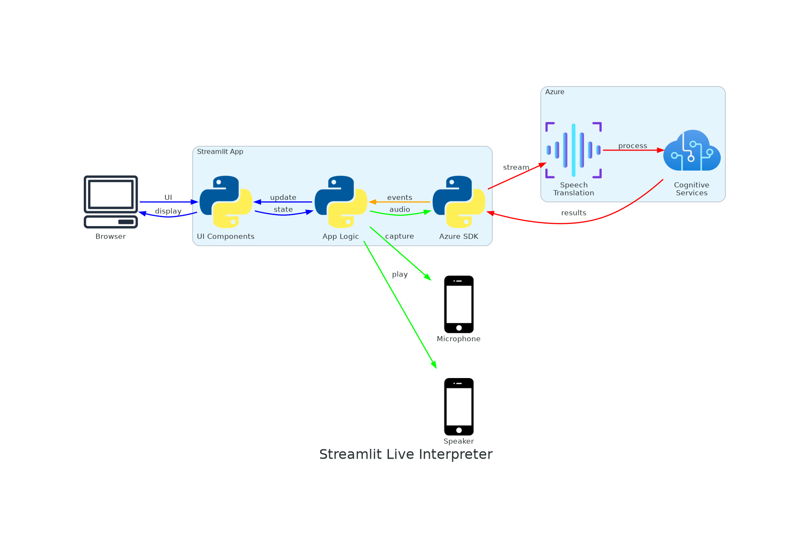
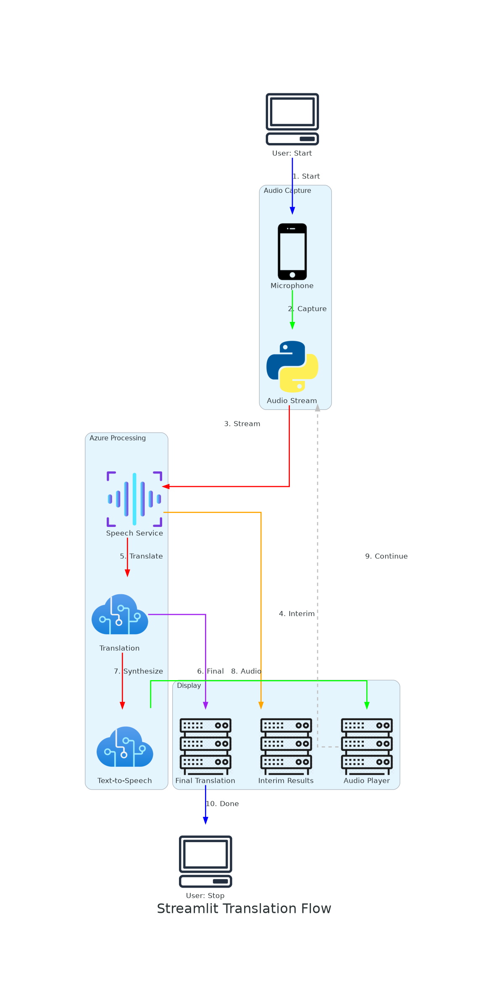

# Streamlit Architecture Diagrams

Visual architecture diagrams for the Streamlit-based Azure Live Interpreter application, generated using the [diagrams](https://diagrams.mingrammer.com/) Python library.

## Diagrams Overview

### 1. Monolithic Architecture Diagram



**File**: `streamlit_monolithic_architecture.png`

This diagram illustrates the complete monolithic architecture of the Streamlit application, showing:

#### Layers and Components

**Presentation Layer (UI Components)**
- **Language Selector**: Dropdown for source/target language configuration
- **Audio Recorder**: Start/Stop recording controls with status indicators  
- **Translation Display**: Real-time display of interim and final translations
- **Audio Player**: Playback controls for synthesized translated audio

**Application Logic Layer**
- **Config Manager**: Loads environment variables from `.env` file
- **Translator (LiveInterpreter)**: Manages Azure Speech SDK translation sessions
- **Audio Handler**: Captures microphone input and handles audio playback
- **Session State**: Streamlit's `st.session_state` for data persistence

**Azure Speech SDK Layer (Python)**
- **SpeechTranslationConfig**: Configuration object for Azure Speech service
- **TranslationRecognizer**: Main interface for speech translation
- **Event Callbacks**: Handles asynchronous events (recognizing, recognized, synthesizing)

**System Audio I/O**
- **Microphone**: Captures PCM audio at 16kHz sample rate
- **Speaker/Headset**: Outputs WAV audio for translated speech

**Azure Cloud Services**
- **Live Interpreter Engine**: Azure's speech translation service
  - Language Detection (automatic)
  - Speech-to-Speech Translation
  - Neural Voice Synthesis (TTS)

#### Key Characteristics

✅ **Monolithic Design**: All components run in a single Python process  
✅ **Direct SDK Integration**: No separate backend server required  
✅ **Synchronous Execution**: UI updates block during translation  
✅ **Session State**: Uses Streamlit's built-in state management  
✅ **Simple Deployment**: Single `app.py` file to run

#### Data Flow

1. User interacts with UI components in the browser
2. UI components communicate with application logic layer
3. Configuration and audio data flow to Azure Speech SDK
4. SDK establishes WebSocket connection to Azure (TLS encrypted)
5. Azure processes audio through translation pipeline
6. Events flow back through callbacks to update session state
7. UI re-renders to display updated translations and audio

---

### 2. Continuous Translation Flow Diagram



**File**: `streamlit_continuous_flow.png`

This diagram shows the step-by-step data flow for **continuous real-time translation mode**:

#### Workflow Steps

**1. User Action: Start Recording**
- User clicks "Start Recording" button
- Initiates the translation session

**2. Audio Capture Process**
- Microphone captures audio input
- Audio stream converted to PCM format (16kHz, 16-bit, mono)
- Streamed to Azure Speech SDK audio input

**3. Azure Processing (Continuous Loop)**

*3a. Speech Recognition*
- **Interim Results**: "recognizing" events with partial text
- **Final Results**: "recognized" events with complete translations

*3b. Translation Pipeline*
- **Language Detection**: Automatically identifies source language
- **Translation Engine**: Translates to target language(s)
- **Neural TTS**: Synthesizes audio in target language (Base64 encoded)

**4. Client Display Updates**
- **Interim Display**: Yellow boxes showing "Recognizing..." with partial text
- **Final Display**: Blue boxes with complete translation text
- **Audio Playback**: Play button for synthesized translated audio

**5. Loop Continues**
- System continues listening for more speech
- Process repeats until user clicks "Stop Recording"

**6. User Action: Stop Recording**
- User ends the session
- Cleanup and session termination

#### Event Types

| Event | Purpose | Display |
|-------|---------|---------|
| `recognizing` | Interim results during speech | Yellow box |
| `recognized` | Final translation with complete text | Blue box |
| `synthesizing` | Generated audio data (Base64) | Play button |
| `canceled` | Error handling | Error message |
| `session_stopped` | Session cleanup | Reset UI |

---

## Technical Specifications

### Audio Format
- **Input**: PCM (Pulse Code Modulation)
- **Sample Rate**: 16kHz
- **Bit Depth**: 16-bit
- **Channels**: Mono (1 channel)
- **Output**: WAV format with neural TTS voice

### Communication Protocol
- **Protocol**: HTTPS/WebSocket Secure
- **Encryption**: TLS 1.2+
- **Connection**: Persistent WebSocket for streaming
- **Data Format**: Binary audio stream + JSON events

### Azure Service Details
- **Regions**: eastus, westus2, westeurope, japaneast, southeastasia
- **Latency**: 
  - Interim results: ~100-300ms
  - Final results with audio: ~1-2 seconds
- **Language Support**: 100+ languages for detection and translation

### Translation Pipeline Events

```
Audio Input → Language Detection → Speech Recognition → Translation
                                           ↓
                                    "recognizing" events
                                    (interim results)
                                           ↓
                                    "recognized" events  
                                    (final translations)
                                           ↓
                                    Neural TTS Synthesis
                                           ↓
                                    "synthesizing" events
                                    (Base64 audio bytes)
```

---

## File Structure

```
src/streamlit_app/
├── app.py                          # Main Streamlit application
│   ├── UI Components (Presentation Layer)
│   ├── Session State Management
│   └── Event Handlers

src/core/
├── config.py                       # Configuration Manager
│   ├── Settings class
│   ├── Environment variables (.env)
│   └── Language/Voice mappings
│
├── translator.py                   # Translation Core
│   ├── LiveInterpreterTranslator
│   ├── AzureSpeechTranslator
│   └── Event callbacks
│
└── audio_handler.py                # Audio I/O
    ├── AudioRecorder (capture)
    └── AudioPlayer (playback)
```

---

## Generating the Diagrams

### Prerequisites

1. **Python 3.10+** installed
2. **GraphViz** installed ([download](https://graphviz.org/download/))
3. **diagrams** package installed

### Installation

```bash
# Activate virtual environment
source .venv/bin/activate

# Install diagrams package (if not already installed)
uv add diagrams

# Or using pip
pip install diagrams
```

### Generate Diagrams

```bash
# Generate architecture diagram
python generate_streamlit_architecture.py

# Generate data flow diagram
python generate_dataflow.py

# Both diagrams will be saved to docs/ directory
```

### Customize Diagrams

Edit the generator scripts to customize:
- Layout direction (`direction="TB"` for top-to-bottom, `"LR"` for left-to-right)
- Colors and styling (via `graph_attr`, `node_attr`, `edge_attr`)
- Add/remove components
- Modify labels and descriptions
- Change output format (`outformat="png"` or `"pdf"`, `"svg"`)

---

## Architecture Comparison

### Streamlit (Monolithic) vs React (Client-Server)

| Aspect | Streamlit | React |
|--------|-----------|-------|
| **Architecture** | Monolithic | Client-Server |
| **Process Model** | Single Python process | Separate frontend + backend |
| **Communication** | Direct SDK calls | WebSocket between client/server |
| **State Management** | `st.session_state` | React state + backend sessions |
| **Execution** | Synchronous | Asynchronous |
| **Deployment** | Simple (1 app file) | Complex (2 services) |
| **Scalability** | Limited | Better (horizontal scaling) |
| **Best For** | Demos, prototypes, dev | Production, multiple users |

### When to Use Streamlit Architecture

✅ **Good for:**
- Development and testing
- Demos and prototypes
- Internal tools
- Single-user scenarios
- Quick deployments

⚠️ **Not ideal for:**
- High-concurrency production environments
- Multiple simultaneous users
- Long-running background tasks
- Microservices architecture

---

## Component Interactions

### Session State Flow

```
UI Components → Write to session_state
                      ↓
            session_state storage
                      ↓
        Read by Application Logic
                      ↓
            SDK Processing
                      ↓
        Callbacks update session_state
                      ↓
            UI re-renders
```

### Event Callback Pattern

```python
# In translator.py
def on_recognizing(evt):
    """Handle interim translation results"""
    st.session_state.interim_text = evt.result.text
    st.session_state.interim_translations = evt.result.translations

def on_recognized(evt):
    """Handle final translation results"""
    translation = {
        'timestamp': datetime.now(),
        'original': evt.result.text,
        'translations': dict(evt.result.translations)
    }
    st.session_state.translation_history.append(translation)

def on_synthesizing(evt):
    """Handle synthesized audio data"""
    audio_bytes = evt.result.audio_data
    st.session_state.latest_audio = base64.b64encode(audio_bytes)
```

---

## Related Documentation

- [README.md](../README.md) - Main project documentation with text-based diagrams
- [Quickstart.md](Quickstart.md) - Getting started guide
- [ProjectStructure.md](ProjectStructure.md) - Detailed project file structure
- [ProductionDeploymentGuide.md](ProductionDeploymentGuide.md) - Production deployment considerations
- [IntegrationGuide.md](IntegrationGuide.md) - Integration patterns and API usage

---

## Diagram Tools Used

- **Library**: [diagrams](https://diagrams.mingrammer.com/) - Python library for creating architecture diagrams
- **Icons**: Azure icons from the diagrams library
- **Layout Engine**: GraphViz (automatic graph layout)
- **Output Format**: PNG (Portable Network Graphics)

---

## License

These diagrams are part of the Live Interpreter API Demo project. See [LICENSE](../LICENSE) for details.

---

**Generated**: December 12, 2025  
**Tool**: Python diagrams library with Azure icons  
**Files**: 
- `streamlit_monolithic_architecture.png` (Architecture Overview)
- `streamlit_continuous_flow.png` (Data Flow Workflow)
